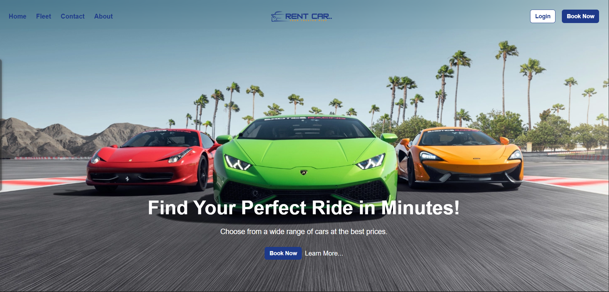

# 🚗 Car Rental Web Platform

Welcome to the **Car Rental Web Platform** — a fully responsive website designed to offer seamless car rental bookings with an elegant and intuitive user interface.

This project is built using **Next.js**, **Tailwind CSS**, and **React Icons**, and is aimed at creating a beautiful and functional user experience.

---

## 🌐 Live Demo

🔗 [**Visit Website**](https://car-rent-platform.netlify.app/)

## 🎨 Figma UI Design

🎨 [**Figma File**](https://www.figma.com/design/tL21LAmEuRKHOPkpffmzdJ/Car-Rental-Web-Platform?node-id=0-1&t=7i9FlteWQ6md6hUu-1)

---

## 🖼️ Preview

> Make sure this screenshot is located in `public/screenshots/hero-preview.png`. You can rename your uploaded image to match.

---

## ✨ Features

- 🚘 View cars by category with filters
- 🎚️ Pricing range slider with live value updates
- 📍 Location-based pickup/dropoff inputs
- 📆 Date & Time picker with calendar
- 📱 Fully responsive across all devices
- 🎨 Custom UI styled with Tailwind CSS
- ⚡ Built for speed and clean design

---

## 🛠️ Tech Stack

- **Next.js 14**
- **Tailwind CSS**
- **React Icons**
- **Figma** for UI design

---

## 📁 Folder Structure

